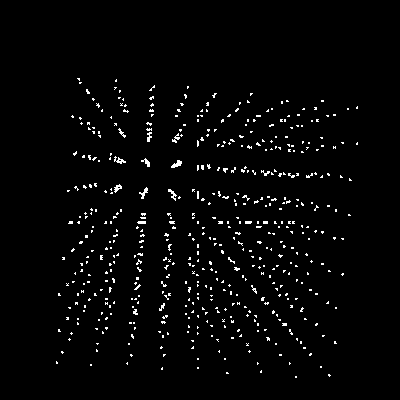

a 3d renderer built in C with SDL

documenting things I try while building this out

## Feb 7 2025
over the past couple weeks I've gotten the groundwork set up to start rendering and rotating point clouds,
or in this case a cube.

a rotating cube is nice and all, but I wondered what would happen if it ran for a really long time,
until the floating point accuracy made the point positions break down --
instead of waiting a long time, I made a couple functions to just truncate the decimals after a certain place
in this case, after 2 decimal places, and the cube quickly breaks down, kind of crumpling up into a single dot

---

built as part of a 3d graphics course from pikuma 🦆 
